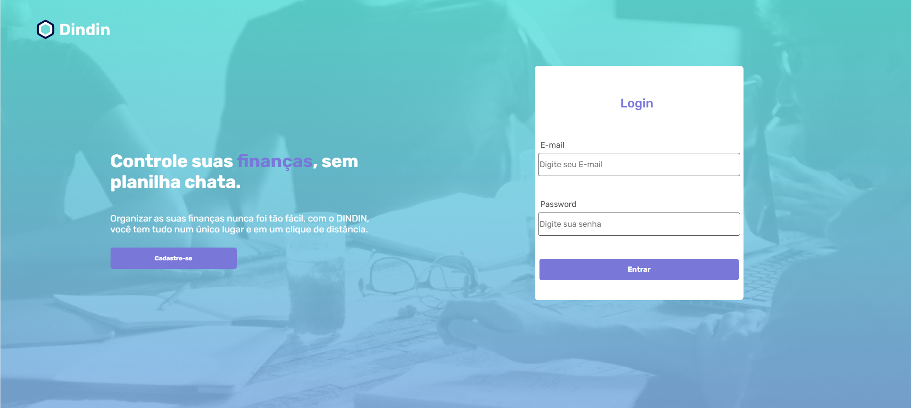
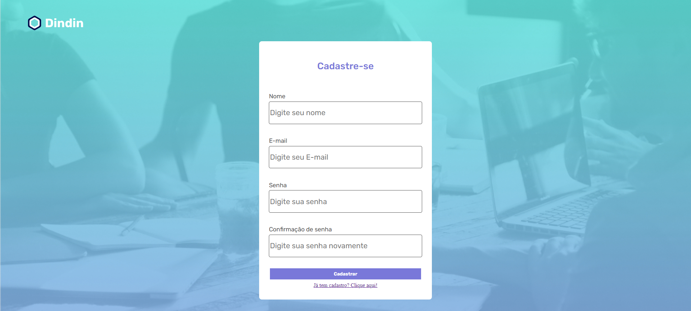

# din-din-project

  
  
  

   
      

<h1 align="center">
    
</h1>

<h4 align="center"> 
🤑 Din Din 🤑
</h4>

 <a href="#about">About</a> •
 <a href="#functionalities">Functionalities</a> •
 <a href="#tecnologies">Tecnologies</a> •
 <a href="#see">Launched version</a> •
  <a href="#run">Run the project</a>

## 💻 About the project
💸 Din Din- Its a project developed during during the Full Stack Software Development course <a href="https://github.com/cubos-academy" target="_blank">@cubosacademy</a> 
  and initialized with <a href="https://vitejs.dev/" target="_blank">Vite</a>.

## ⚙️ Functionalities

    

-  Register user 
<h1 align="center">
   
</h1>
-  LogIn 
-  LogOut 
-  Register Transaction
<h1 align="center">
   
</h1>
<h1 align="center">
   
</h1>
-  Edit Transaction 
-  Delete Transaction
<h1 align="center">
   
</h1>
-  List Transactions 
-  Summary and Balance
<h1 align="center">
   
</h1>

## 🛠 Tecnologies
For this project I used :	

	

## 👀 See the launched version:

Open [https://din-din-project.vercel.app/](https://din-din-project.vercel.app/) to view it in your browser.

## 🏃‍♀️ Run the project
 Clone this repository:

### `git@github.com:Kauanedev/din-din-project.git`

Run this code to acess the project before starting:
### `cd din-din`

### `npm install`
### `npm start`

Runs the app in the development mode.\
Open [http://localhost:5173]([http://localhost:3000](http://localhost:5173)) to view it in your browser.
http://localhost:5173/
The page will reload when you make changes.\
You may also see any lint errors in the console.

